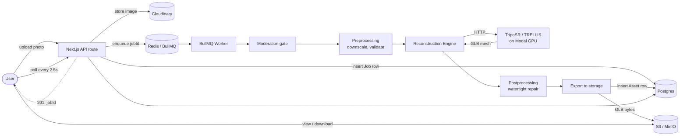
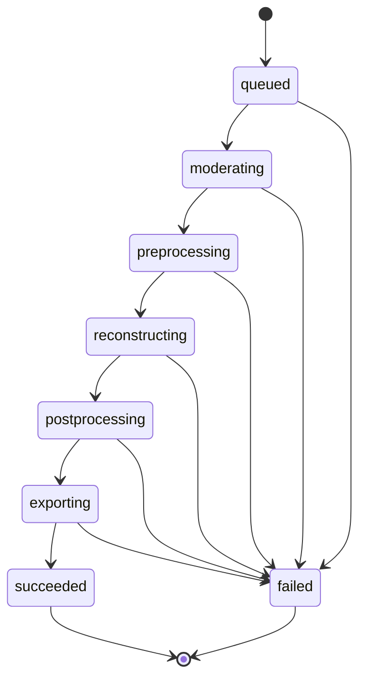

<div align="center">

# 3dify

**Turn a single photo into a downloadable, browser-viewable 3D asset.**

Sign in, upload a picture, and an async pipeline handles screening,
preprocessing, AI reconstruction, mesh cleanup, and storage, no 3D
modeling experience required.

[](https://nextjs.org/)
[](https://react.dev/)
[](https://www.typescriptlang.org/)
[](https://www.postgresql.org/)
[](https://redis.io/)
[](https://www.docker.com/)
[](./LICENSE)

</div>

---

## Intro

3dify is a web service that turns a single photo of an object into a
downloadable GLB (glTF binary) 3D asset. A user signs in with Google,
uploads a photo, and a background pipeline runs it through content
moderation, preprocessing, AI-based 3D reconstruction, and mesh
repair, landing the finished, watertight mesh in a permanent asset
library with an in-browser `<model-viewer>` preview and a download link.

Reconstruction is served by [TripoSR](https://github.com/VAST-AI-Research/TripoSR)
running as a serverless GPU function on [Modal](https://modal.com/) (scale-to-zero,
no idle GPU cost), with a higher-fidelity [TRELLIS](https://github.com/microsoft/TRELLIS)
engine available as a drop-in upgrade behind the same interface.

**Key properties:**
- **Asynchronous, resumable pipeline:** BullMQ-backed job queue with a pure,
  fully-tested state machine driving `queued → moderating → preprocessing →
  reconstructing → postprocessing → exporting → succeeded`
- **Pluggable reconstruction engine:** swap TripoSR, TRELLIS, or a local stub
  cube via a single env var, no code changes
- **Production-shaped storage:** Cloudinary for source images, any
  S3-compatible bucket (MinIO locally, Backblaze B2/Cloudflare R2 in prod)
  for generated assets
- **Guardrails baked in:** upload format/size/dimension enforcement,
  optional Cloudinary moderation gate, terminal vs. transient failure
  handling with retries

---

## How to Setup

### Prerequisites

- [Node.js 22+](https://nodejs.org/) and [pnpm](https://pnpm.io/)
- [Docker](https://www.docker.com/) (Postgres, Redis, MinIO run in containers)
- A [Google OAuth](https://console.cloud.google.com/apis/credentials) client
- A [Cloudinary](https://console.cloudinary.com/) account (free tier is fine)
- Optional: a [Modal](https://modal.com/) account, for real (non-stub) 3D reconstruction

### 1. Clone and install

```bash
git clone https://github.com/DevloperHS/3dify_oss.git
cd 3dify_oss
pnpm install
```

### 2. Configure environment

```bash
cp .env.example .env
```

Follow the inline comments in `.env.example` for exactly where each value
comes from; the table below is just the minimum you need and where to sign
up for each service:

| Variable | Purpose | Sign up |
|---|---|---|
| `BETTER_AUTH_SECRET` | Session signing, generate with `npx @better-auth/cli secret` | n/a |
| `GOOGLE_CLIENT_ID` / `GOOGLE_CLIENT_SECRET` | Sign-in (redirect URI: `http://localhost:3000/api/auth/callback/google`) | [console.cloud.google.com/apis/credentials](https://console.cloud.google.com/apis/credentials) |
| `CLOUDINARY_CLOUD_NAME` / `CLOUDINARY_API_KEY` / `CLOUDINARY_API_SECRET` | Source image storage | [cloudinary.com](https://cloudinary.com/users/register/free) |
| `S3_*` | Generated GLB storage; MinIO defaults already work out of the box | n/a (or [backblaze.com/b2](https://www.backblaze.com/cloud-storage) for prod) |
| `RECONSTRUCTION_ENGINE`, `MODAL_*` | `stub` (no account needed), `modal` (TripoSR), or `trellis` | [modal.com](https://modal.com/signup) |

### 3. Start infrastructure

```bash
docker compose up -d   # Postgres, Redis, MinIO (+ bucket bootstrap)
pnpm db:push            # sync the Drizzle schema
```

### 4. Run the app

```bash
pnpm dev      # Next.js on http://localhost:3000
pnpm worker   # BullMQ worker, run in a second terminal
```

Sign in, upload a photo, and watch it progress through the pipeline on the
job page. With `RECONSTRUCTION_ENGINE=stub` you'll get a placeholder cube;
switch to `modal` (after `modal deploy modal/triposr_app.py`) for a real mesh.

### Verification

```bash
pnpm typecheck   # tsc --noEmit
pnpm test        # vitest, needs docker compose up (hits a real test DB)
pnpm build       # production build
```

---

## How it Works



The job status itself is driven by a pure, dependency-free state machine,
the most heavily tested module in the codebase, since it encodes every
business rule about how a job may progress:



Rules encoded: transitions are strictly forward-only, unbuilt/optional
stages may be skipped, and terminal states (`succeeded`, `failed`) have no
exits. `failed` is reachable from any non-terminal state so a crash at any
stage surfaces a clean, retryable failure rather than a stuck job.

---

## Techstack

<div align="center">

| Layer | Technology |
|---|---|
| Framework |   |
| Language |  |
| Styling |  |
| Auth |   |
| Database |   |
| Queue |   |
| 3D Reconstruction |   TripoSR / TRELLIS |
| Image Storage |  |
| Asset Storage |   |
| 3D Viewer |  |
| Testing |  |
| Infra |  |

</div>

---

## How to Contribute

Contributions are welcome: bug fixes, new reconstruction engines, or
pipeline stage improvements.

1. **Fork** the repo and create a feature branch off `main`:
   ```bash
   git checkout -b feat/short-description
   ```
2. **Set up locally:** follow [How to Setup](#how-to-setup) above.
   `RECONSTRUCTION_ENGINE=stub` is enough for pipeline/UI work that doesn't
   touch reconstruction quality itself.
3. **Make your change**, keeping it scoped: one logical change per PR.
4. **Verify before pushing:**
   ```bash
   pnpm typecheck
   pnpm test
   pnpm build
   ```
5. **Commit** with a clear, imperative message (e.g. `Fix watertight repair
   on meshes with disjoint boundary loops`), explaining *why* when it isn't
   obvious from the diff.
6. **Open a pull request** against `main` describing what changed and how
   you verified it (tests added/updated, manual repro steps, etc.).

For larger changes (a new reconstruction engine, a new pipeline stage),
open an issue first to discuss approach before investing implementation
time.

---

## License

[MIT](./LICENSE) © 2026 DevloperHS
